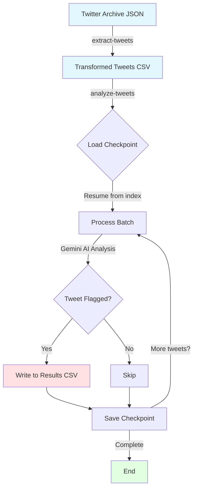

# Tweet Audit

Optional Tweet Audit tool written in Typescript

## Prerequisites

- Bun – fast all-in-one JavaScript runtime
- A Google Gemini API key (free tier available at https://aistudio.google.com/app/apikey)

## Installation
```
- git clone https://github.com/baq-git/tweet-audit.git
- cd tweet-audit
- bun install
```

## Quick Start

1. Request and download your Twitter/X archive using this tool: https://github.com/prinsss/twitter-web-exporter (follow this tool's instruction to download any account's tweets)

2. Set your API key in .env file (create .env in this tool's directory)

3. Extract json or csv

```
bun start extract-tweets /path/to/your-twitter-archive/tweets.jsonORcsv

```
4. Analyze exported tweets:

```
bun start analyze-tweets

```

## How it work:
The tool works in two simple steps:

- Extract: Turn your Twitter posts with provided JSON file path into a clean CSV file of your tweets.
- Analyze: Send your tweets to Gemini AI in small batches (default 5 tweets at a time), flag any problematic ones, and save progress after every batch.

The “analyze” step is designed for big archives: it processes one batch, saves a checkpoint, and stops. Just run it again until everything is done.



## Configuration
### Enviroment:
Reconmmend using a .env file

```
GEMINI_API_KEY="your-api-key-here"
X_USERNAME="your_twitter_handle"      # Default: baq
GEMINI_MODEL="gemini-2.5-flash"       # Default: gemini-2.5-flash
```

### Criteria Config

```
 {
    forbiddenWords: [],
    topicsToExclude: [
      "Profanity or unprofessional language",
      "Personal attacks or insults",
      "Outdated political opinions",
    ],
    toneRequirements: [
      "Professional language only",
      "Respectful communication",
    ],
    additionalInstructions:
      "Flag any content that could harm professional reputation",
  };
```

## Development
### Running Tests
```
# Test all
bun test

# Test with coverage
bun test --coverage

# Test with specific function or service: create a file with __test.ts postfix
bun test writer     # example for test writer_test.ts

```


## License
MIT – fork and improve freely!
